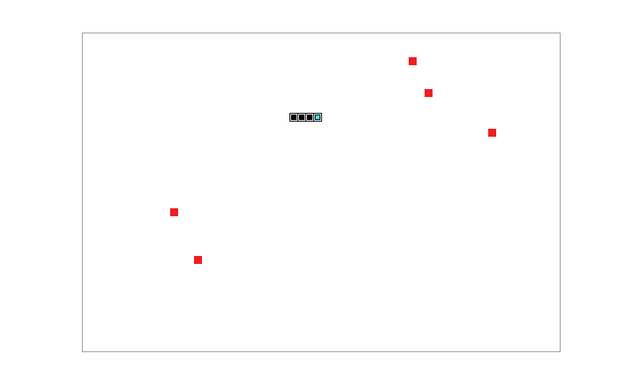

# 贪吃蛇（canvas 简易版）

按照百度IFE2017的任务——[贪吃蛇](http://ife.baidu.com/2017/course/detail/id/31)的要求，基于`p5.js`实现；

## 实现思想

1. 简单的只加入了『蛇身』和『食物』两种元素，并用两个**数组**用来记录它们的『坐标』；
2. 将地图分割为`col x row`个方格，所谓的『坐标』就是处于第`y`行的第`x`个方格之中；
3. **蛇身如何前进**：设置一个全局变量用来记录『前进方向』，如：`[1, 0]`（向右）,`[0, -1]`（向上）等等；根据当前前进方向来得出『蛇头』的下一步位置，而实际上可以看做把『蛇尾』移到『蛇头』的下一步位置，而其他部分保持不变，这就完成了整个『蛇身』的一次前进；
4. **蛇身的前进速度**：可以通过控制『更新时间间隔』（即每帧间隔时间）来控制速度；
5. **蛇身如何转向**：根据方向键改变当前的前进方向即可，需要注意的是改变后的方向不能是当前方向的相反方向（即不能『后退』）；由于存在『更新时间间隔』，如果在**时间间隔内**多次触发改变方向，就可能造成最终改变的方向与当前方向相反，因此不能通过触发方向键就立马改变『前进方向变量』，而是通过**将改变后的方向用另一个变量保存**，在更新下一步时再改变当前方向！
6. **吃到食物身体变长**：可以在更新下一步的时候，判断下一步蛇头的位置是否为『食物』，如果是直接往『蛇身』列表中添加（`unshift`）该位置即可，并将该位置从『食物』列表中删去；
7. **检测撞墙和撞到自己**：通过『蛇头』的坐标即可检测是否撞墙，而通过遍历『蛇身』列表可以判断『蛇头』是否撞到自己；

**效果预览图**：

