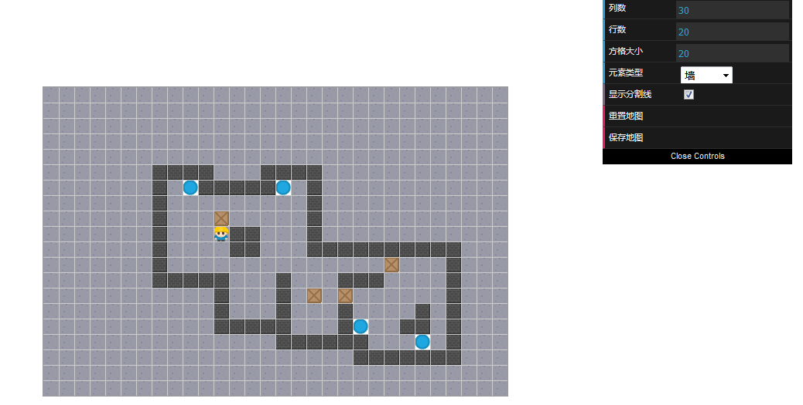
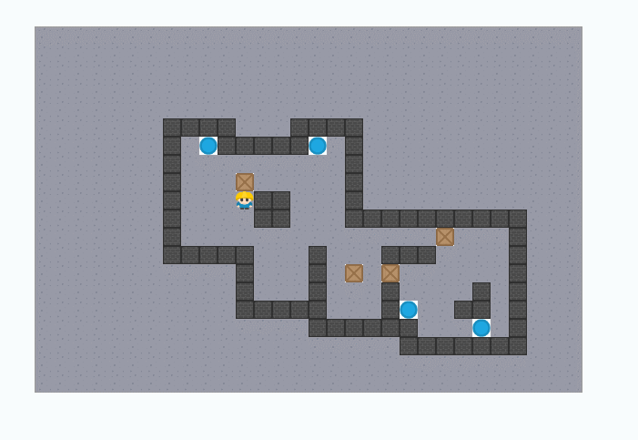

# 推箱子（canvas版）

根据百度IFE2017的任务——[推箱子](http://ife.baidu.com/2017/course/detail/id/66)的要求，基于`p5.js`和`dat.GUI`实现；

## 实现思路

### 地图制作

1. 将地图分为`col x row`个方格，并用一个**二维数组**来保存地图的元素信息；其中，索引为『坐标』，数组元素为对应方格的**元素类型**，如：`0`代表背景，`1`代表墙，`2`代表箱子，`3`代表放置点；
2. 地图的绘制：通过加载各个元素类型的类型，遍历二维地图数组，根据元素类型和坐标在对应位置绘制相应的图片元素即可；
3. 然后可以将地图信息保存为`json`格式，在游戏中加载即可；

### 游戏

1. 首先加载`json`格式的地图信息，并按相同方法绘制出地图；
2. **人物的移动**：通过方向键得出下一步的位置，根据下一步位置的元素类型判断具体情况：如果是『背景』或『放置点』直接将人物位置移动即可，如果是『墙』则无法移动，如果是『箱子』则需进一步判断『箱子』按照当前方向前进一步的位置，如果『箱子』的下一步为『背景』或『目标点』则『人物』和『箱子』都前进一步，反之则不移动；
3. **游戏通过的判断**：可以通过触发每次『箱子』移动到『目标点』时进行判断，若所有的『箱子』都在『目标点』的位置即为通过本关；
4. **可以优化的地方**：游戏中有『动』与『不动』的元素，『不动』的元素如『背景』、『墙』和『目标点』；对于『不动』的元素，没有必要在每一次移动都进行『重绘』，因此可以将这些『不动』的元素保存，每次只需要将『动』的元素绘制到上面即可；

地图制作预览：

游戏预览：

