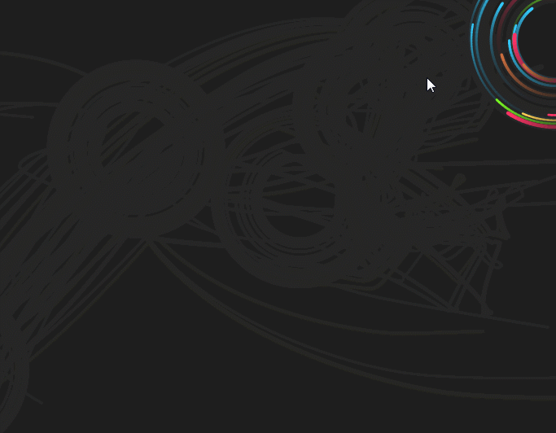

## 前言

前不久在一个[博客网站](https://lab.hakim.se/trail/03/)上看到这样一个`canvas`特效：

由于gif录制看着可能有些卡顿，而实际上该动画运行特别流畅，能够达到`60FPS`！之前也看到类似这种带有『拖尾（trail）』效果的动画，所以一直很好奇是怎么实现的。

## 我的思路

首先可以从动画看出这种『拖尾』的效果相当于**透明度逐渐减少且尺寸也变小**，于是立马想到之前实现的『贪吃蛇』的原理：

1. 每一个『拖尾球』由**一组圆形图形叠加**而成，且从头部到尾部每个圆形的尺寸及透明度都依次减小；
2. 而移动方式就类似于『贪吃蛇』，而只需要**用数组保存每个圆形的位置**即可，每次**增加头部移动后的位置并删除尾部位置**即可；
3. 移动方式可以分两种：一种是由远处靠近围绕的轨道，另一种就是在轨道上进行围绕；

然而，事实上证明这种简单的实现方式存在**很多问题**：

1. 当某个球的运动速度较大（一般是大于半径的`1/3`时），就会出现**间隔较大**导致拖尾效果很差：

   

   一种可行的办法就是根据两球之间的间距适当的**插入一定数量的球**；

2. 运行性能很差（当绘制5个『拖尾球』时只有`45FPS`，10个时只有不到`30FPS`），可以想象一个『拖尾球』实际上由**几十到上百个圆形**绘制而成，当出现`10`个拖尾球时**每一帧**要绘制上千个圆形，工作量可想而知；

从以上问题可以看到，原作者使用的『拖尾』效果原理肯定不是这么简单低效的；

## 源码思路

看完源码后我真的自愧不如，可以说基本上是利用了一些`canvas`的渲染原理简简单单的就实现了拖尾的效果，一点多余的东西都没有。该博客中的源码主要利用了以下的原理：

1. **颜色混合模式**（`Blend Mode`）：颜色混合指的就是同一像素点**设置新的颜色值**的时候如何与**之前的颜色值**进行混合（`Blend`），`canvas`中默认的`BlendMode`为`BLEND`（不透明度计算）：

$$
C=d*A+(1-d)*B
$$

​	其中，`A`指的是新颜色值（目标颜色），`B`指的是源颜色，而`d`为`A`的不透明度（取值为`0-1`），`C`为混合后得到的颜色值；

2. 在绘制直线的时候，直线的两端的形状称为**线帽**（`lineCap`），而默认的线帽形状为一个**半圆**（`round`）；

而利用以上的原理就可以轻松地绘制出带有『拖尾』效果的球形物体：

1. 每一帧**重绘**的时候，将背景颜色的不透明度设为`0.05`（小于`1`即有拖尾效果，数值越低拖尾长度越大）；
2. 每次只需绘制球运动后的**下一步位置**即可，但并非直接画一个圆，而是直接**将直线的宽度设为圆的直径**，在当前点和下一点位置之间**画一条直线**，由于**线帽形状**的特点，在**两端**自然有圆形形状填充！
3. 由于背景颜色具有小于`1`的不透明度，相当于之前绘制的图案仍然会出现，只是由于**默认的颜色混合模式**的特点，**非背景颜色部分的不透明度会有所下降**！然后这一帧绘制的直线会与前一帧绘制的直线有**部分重叠**，这一**重叠部分的不透明就有所增加**。在经过很多帧绘制后自然就形成了**先绘制的图案不透明度越低**，且宽度越小（因为**同一直线段的先重叠的部分会先不透明度变成`0`**）！

按照以上思路实现后的效果如下：

## 感想

通过这次代码的实现和对源码的分析发现，从本质出发和从表面现象出发去看待问题真是有着质的区别。从本质看待问题毫无疑问是最高效的方法，任何多余的东西都不会产生，然而要看透问题的本质需要深厚的基础来支撑！

## 参考文档

1. [p5.js | blendMode()](https://p5js.org/reference/#/p5/blendMode)
2. [【叠加模式】Photoshop图层混合模式的计算公式 - cgspread](http://www.cgspread.com/3551.html)
3. [Trail - an experiment with particle movement patterns using HTML5.](https://lab.hakim.se/trail/03/)